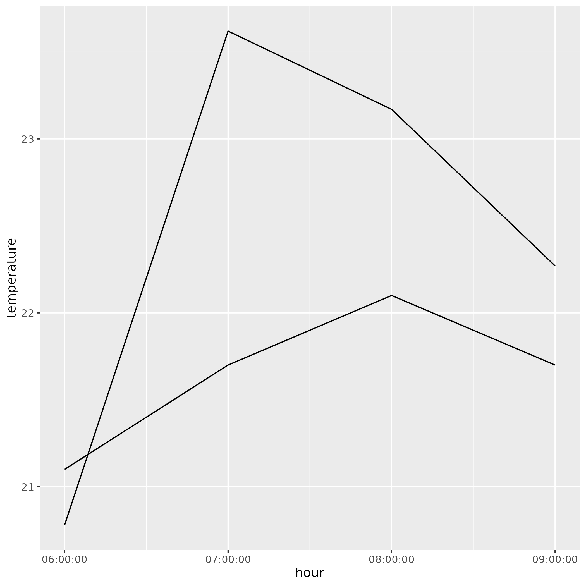
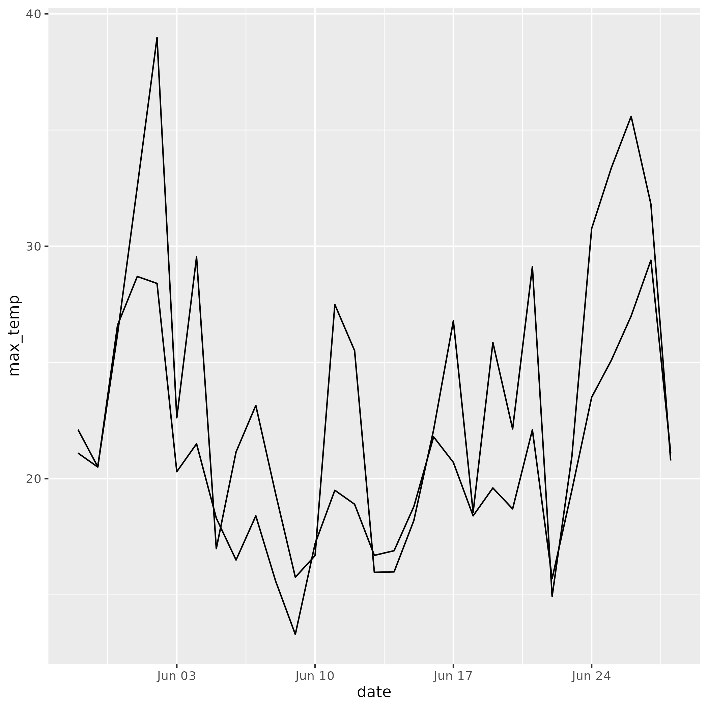

```{r include = FALSE}
library(readr)
current <- read_tsv('data/current_values.tsv')
```

# Current temperature: `r current$temperature[1]`°C 
# Humidity: `r current$humidity[1]`%

## Today's temperature:



## Last Month:
